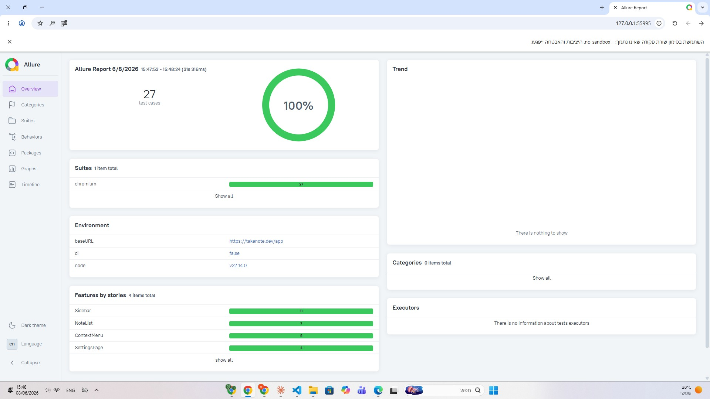
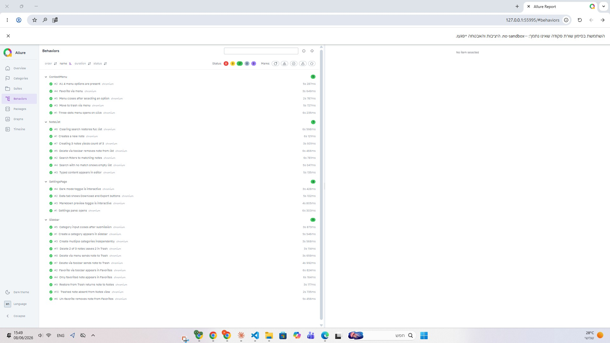
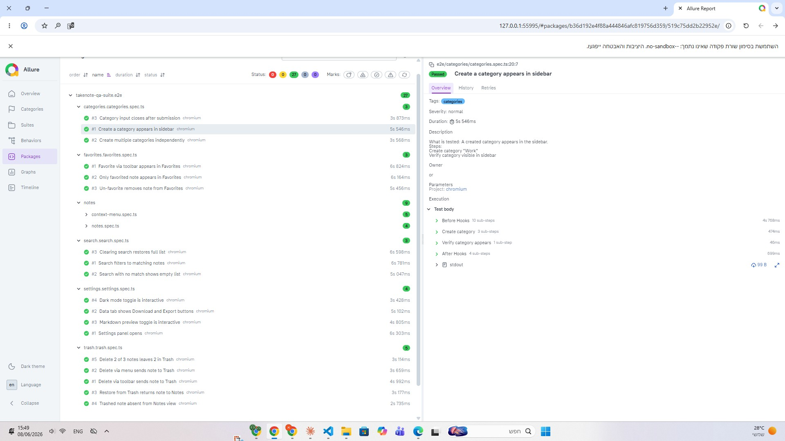
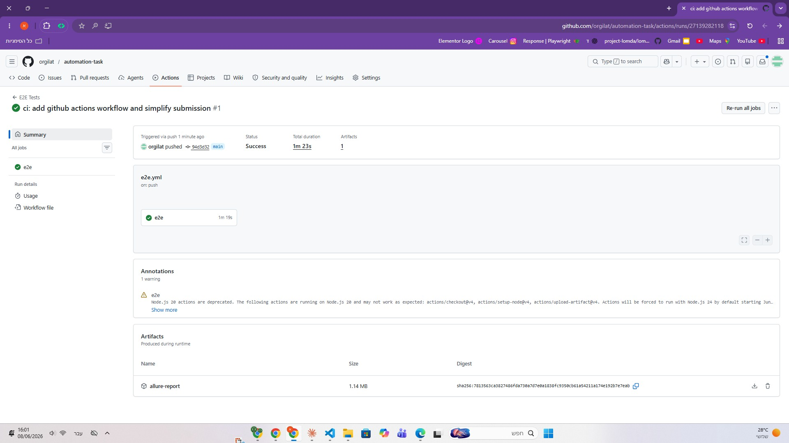

# TakeNote QA Suite

End-to-end test automation suite for [TakeNote](https://takenote.dev) — an open-source, client-side React notes application. Built with Playwright and TypeScript, following the Page Object Model pattern with Allure reporting, GitHub Actions CI, and a custom multi-agent build pipeline powered by the Anthropic SDK.

---

## For the Reviewer

This project was built to make evaluation as frictionless as possible:

- **`make run`** — one command: builds the Docker image, runs all tests, generates Allure report with trend history, serves it at `http://localhost:5050`
- **No environment variables required** to run the tests
- **Run twice** to see Allure trend graphs (history persists in `.allure-history/`)
- **On CI failure** — Claude analyzes each failing test and writes a diagnosis to `failure-analysis.md`

---

## Screenshots

### Demo — Docker execution
[▶ Watch demo (docker-exec-video.mp4)](docker-exec-video.mp4)

### Allure Overview — 27/27 passing

100% pass rate. Run duration, environment info, feature breakdown by component.

### Allure Behaviors — tests by component

All tests grouped by UI region: ContextMenu, NoteList, SettingsPage, Sidebar.

### Allure Packages — test detail

Step-level detail: Before Hooks, test body steps, stdout logs, Allure metadata.

### GitHub Actions — CI passing

Successful CI run (1m 23s) with Allure report uploaded as downloadable artifact.

---

## Running Tests

### Simplest — Docker

```bash
make run
# Report opens at http://localhost:5050
```

`make run` wraps `docker build` + `docker run` — port mapping, volume mount for Allure history, `BASE_URL`. Nothing to configure.

> **Windows users:** `make` requires GNU Make.
> Install via Git Bash: `winget install GnuWin32.Make` then restart Git Bash.
> Or run directly:
> ```bash
> docker build -t takenote-tests . && docker run --rm -p 5050:5050 \
>   -v $(pwd)/.allure-history:/app/allure-history \
>   -e BASE_URL=https://takenote.dev/app takenote-tests
> ```

### Local (no Docker)

```bash
npm ci
npx playwright install --with-deps chromium
npm test
npm run report:open
```

### Full local run with Allure history

```bash
npm run test:full
```

Clears old results, preserves Allure history for trend graphs, runs all tests, generates and opens the Allure report locally.

---

## Test Coverage

| Feature | Tests |
|---------|-------|
| **Notes CRUD** | Creates a new note · Typed content appears in editor · Delete via toolbar removes note from list · Creating 3 notes yields count of 3 |
| **Context Menu** | Three-dots menu opens on click · All 4 menu options are present · Move to trash via menu · Favorite via menu · Menu closes after selecting an option |
| **Trash** | Delete via toolbar sends note to Trash · Delete via menu sends note to Trash · Restore from Trash returns note to Notes · Trashed note absent from Notes view · Delete 2 of 3 notes leaves 2 in Trash |
| **Search** | Search filters to matching notes · Search with no match shows empty list · Clearing search restores full list |
| **Favorites** | Favorite via toolbar appears in Favorites · Only favorited note appears in Favorites · Un-favorite removes note from Favorites |
| **Categories** | Create a category appears in sidebar · Create multiple categories independently · Category input closes after submission |
| **Settings** | Settings panel opens · Data tab shows Download and Export buttons · Markdown preview toggle is interactive · Dark mode toggle is interactive |
| **Total** | **27 tests** |

---

## Architecture

```
takenote-qa-suite/
├── .github/
│   └── workflows/
│       └── e2e.yml              # CI: push to main + PRs → run tests → upload Allure report
├── agents/                      # Multi-agent build pipeline (Anthropic SDK)
│   ├── bootstrapOrchestrator.ts # Full pipeline: scrape → tests → validate → PR
│   ├── editOrchestrator.ts      # Modify existing tests via YAML input
│   ├── fixOrchestrator.ts       # Auto-repair failing tests
│   ├── context/
│   │   ├── patterns.md          # Code conventions enforced by CleanCodeAgent
│   │   ├── pages.md             # POM registry for agent context
│   │   └── raw-locators.yaml    # DOM locators scraped from the live app
│   ├── core/
│   │   ├── runner.ts            # Anthropic SDK agent loop with tool use
│   │   └── tools.ts             # File read/write/shell tools available to agents
│   ├── specialists/             # One agent per responsibility
│   │   ├── locatorAgent.ts      # Navigates live app, extracts elements into raw-locators.yaml
│   │   ├── pomWriterAgent.ts    # Converts locators into typed Page Object Models
│   │   ├── fixtureWriterAgent.ts# Registers POMs into fixtures.ts
│   │   ├── testBuilderAgent.ts  # Generates spec files from input.yaml
│   │   ├── cleanCodeAgent.ts    # Enforces patterns.md across all files
│   │   ├── tsCompilerAgent.ts   # Runs tsc --noEmit, fixes errors in a loop
│   │   ├── validationAgent.ts   # Runs Playwright, captures stdout + exit code
│   │   ├── debugAgent.ts        # Classifies and fixes test failures
│   │   ├── summaryAgent.ts      # Prints pipeline summary after each run
│   │   ├── onlyCleanupAgent.ts  # Strips .only markers before commit
│   │   ├── prAgent.ts           # Commits changed files and pushes to GitHub
│   │   └── failureAnalyzerAgent.ts # Parses Allure JSON → Claude diagnosis → failure-analysis.md
│   ├── input.yaml               # Describes what tests to generate (bootstrap input)
│   └── fix-input.yaml           # Describes what failed and needs fixing (fix input)
├── pages/                       # Page Object Models — one class per UI region
│   ├── SidebarPage.ts           # Left sidebar: navigation, categories
│   ├── NoteListPage.ts          # Middle column: note list, search
│   ├── EditorPage.ts            # Right column: CodeMirror editor, toolbar buttons
│   ├── ContextMenuPage.ts       # Three-dots context menu
│   └── SettingsPage.ts          # Settings modal (preferences, data management)
├── tests/
│   └── e2e/
│       ├── notes/               # Notes CRUD + context menu (9 tests)
│       ├── categories/          # Category management (3 tests)
│       ├── favorites/           # Favorites flow (3 tests)
│       ├── search/              # Search functionality (3 tests)
│       ├── trash/               # Trash and restore (5 tests)
│       └── settings/            # Settings modal (4 tests)
├── helpers/
│   ├── allureLabels.ts          # setFunctionalAllureMeta, addTestDescription
│   └── localStorage.ts          # LocalStorage utilities
├── scripts/
│   └── test-full.ts             # Local runner: clear results → run → generate → open report
├── fixtures.ts                  # Playwright fixtures: POM injection via base.extend()
├── logger.ts                    # Winston structured logger
├── playwright.config.ts         # Playwright config: baseURL, retries, reporters, viewport
├── Dockerfile                   # Playwright 1.60 + Allure 2.29 container
├── run-tests.sh                 # Container entrypoint: restore history → run → report → serve
└── Makefile                     # make run: docker build + docker run with volume + port
```

---

## Page Object Models

| POM | Region | Key Locators |
|-----|--------|--------------|
| `SidebarPage` | Left sidebar | `createNoteButton`, `notesLink`, `favoritesLink`, `trashLink`, `addCategoryButton`, `newCategoryInput` |
| `NoteListPage` | Note list | `searchInput`, `noteItems` (`[data-testid^="note-list-item"]`), `noteOptionsButtons` |
| `EditorPage` | Editor panel | `editorArea` (`.CodeMirror`), `favoriteButton`, `moveToTrashButton`, `settingsButton` |
| `ContextMenuPage` | Context menu | `favoriteOption`, `trashOption`, `downloadOption`, `copyReferenceOption`, `restoreFromTrashButton`, `deletePermanentlyButton` |
| `SettingsPage` | Settings modal | `preferencesTab`, `dataManagementTab`, `markdownPreviewToggle`, `darkModeToggle`, `downloadAllButton` |

---

## CI/CD

**`e2e.yml`** — Triggers on push to `main` and all pull requests. Installs Node 20, installs Playwright Chromium with system dependencies, runs `npx playwright test --project=chromium`, generates the Allure report, and uploads it as a downloadable artifact retained for 30 days. The report is uploaded even when tests fail, so every failure is diagnosable from CI.

**Failure analysis** — `npm run ci:analyze-failures` reads the Allure JSON results, sends each failure to Claude (`claude-sonnet-4-5`), and writes a per-test diagnosis to `failure-analysis.md`. Optionally posts a summary to Slack via `SLACK_WEBHOOK_URL`. Run this manually after a CI failure or wire it into your own notification workflow.

---

## Agent Pipeline

This suite was scaffolded and maintained using a custom multi-agent system built on the Anthropic SDK. Each agent has a single responsibility and communicates through files on disk.

| Agent | Role |
|-------|------|
| `LocatorAgent` | Navigates the live app, extracts all interactive elements into `raw-locators.yaml` |
| `PomWriterAgent` | Converts raw locators into typed Page Object Model classes in `pages/` |
| `FixtureWriterAgent` | Registers new POMs into `fixtures.ts` |
| `TestBuilderAgent` | Reads `agents/input.yaml` and generates spec files |
| `CleanCodeAgent` | Enforces every rule in `patterns.md` — removes `waitForTimeout`, raw locators, fat specs |
| `TsCompilerAgent` | Runs `tsc --noEmit` in a loop until the build is clean |
| `ValidationAgent` | Runs Playwright and captures stdout + exit code for the debug loop |
| `DebugAgent` | Two-phase: classifies `SYSTEM_BUG` vs `CODE_BUG`, then edits files to fix code bugs |
| `SummaryAgent` | Prints a pipeline summary after each run |
| `OnlyCleanupAgent` | Strips `.only` markers before commit to prevent accidental partial runs |
| `PrAgent` | Validates `.gitignore`, commits changed files, pushes to the feature branch |
| `FailureAnalyzerAgent` | Reads Allure JSON → sends each failure to Claude → writes `failure-analysis.md` |

**Bootstrap pipeline** (`npm run agents:bootstrap`):

```
scrape DOM → write POMs → register fixtures → generate tests →
enforce patterns → TypeScript check → run Playwright →
debug loop (if failures) → human approval → strip .only → push PR
```

Other pipeline commands:

```bash
npm run agents:edit    # Modify existing tests via YAML description
npm run agents:fix     # Auto-repair failing tests
npm run agents:clean   # Re-enforce code standards across all files
```

Requires `ANTHROPIC_API_KEY` in `.env`. The tests themselves have no such requirement.

---

## Design Decisions

**Why E2E only — no API tests?**
TakeNote is a client-side-only React app with no backend API. All state lives in browser `localStorage`. E2E is the only meaningful test layer for this architecture.

**Why the public demo URL?**
Tests target `https://takenote.dev/app`. Each test navigates fresh via `beforeEach`, so state never bleeds between tests. No local setup, no build pipeline — the reviewer runs `make run` and gets results immediately.

**Test isolation via `beforeEach`:**
Each spec uses a `beforeEach` that navigates to the app. Tests use relative count assertions (`countAfter === countBefore + 1`) rather than absolute numbers. This is robust to TakeNote's default "Welcome to TakeNote!" note and works identically locally and in CI, where each test gets a fresh browser context with empty `localStorage`.

**Search assertions use `expect.poll()`:**
TakeNote's search is client-side React — `fill()` fires the input event but React's async re-render completes asynchronously. `expect.poll(() => noteListPage.getNoteCount(), { timeout: 5000 })` retries the count check until the filtered state is reflected, without resorting to `waitForTimeout`.

**Why Allure with history?**
Playwright's HTML reporter is great for local debugging. Allure adds step-level detail, screenshots, trace links, and trend graphs across runs. Both the Docker container (`make run`) and the local script (`npm run test:full`) persist history in `.allure-history/` so flakiness patterns accumulate across runs.

**The Makefile:**
`make run` reduces a multi-flag `docker run` command to one word. A deliberate UX decision so reviewers don't need to read docs to run the suite.

**CodeMirror interaction:**
The editor overlays a `<textarea>` with its own render layer. Clicks target `.CodeMirror` (the container); content is typed via `page.keyboard.type()` after clicking the container.

---

## Requirements

- Node.js 20+
- Docker (for `make run`)
- Chromium — `npx playwright install chromium` (for local execution)

Built with: **Playwright 1.60** · **TypeScript 5.7** · **Allure 3.0** · **Claude Sonnet 4.5** · **Docker** · **GitHub Actions**
